<!-- Please do not change this logo with link -->

<a target="_blank" href="https://www.microchip.com/" id="top-of-page">
   <picture>
      <source media="(prefers-color-scheme: light)" srcset="images/mchp_logo_light.png" width="350">
      <source media="(prefers-color-scheme: dark)" srcset="images/mchp_logo_dark.png" width="350">
      
   </picture>
</a>

# USB Human Interface Device (HID) Mouse Demo Using Curiosity Nano Explorer
This example demonstrates how to use the USB Human Interface Device (HID) class as a mouse on the AVR® DU microcontroller (MCU), paired with the AVR64DU32 Curiosity Nano Evaluation Kit, to interface with the Curiosity Nano Explorer Board.

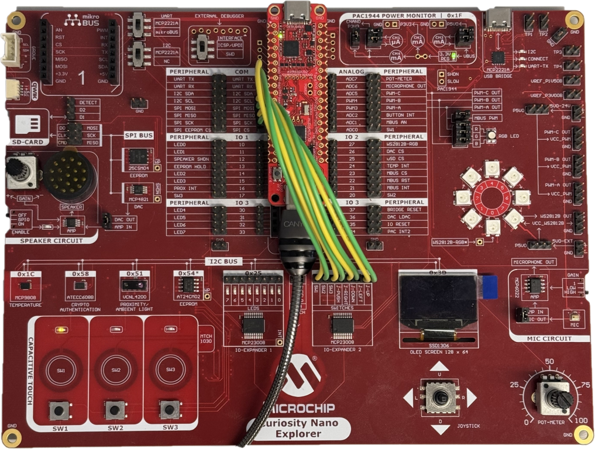

## Related Documentation
- [AVR® DU Family Product Page](https://www.microchip.com/en-us/products/microcontrollers-and-microprocessors/8-bit-mcus/avr-mcus/avr-du?utm_source=GitHub&utm_medium=TextLink&utm_campaign=MCU8_AVR-DU&utm_content=avr64du32-cnano-usb-hid-mouse-mplab-mcc-github&utm_bu=MCU08)

### USB Specifications

- [USB 2.0 Specification](https://www.usb.org/document-library/usb-20-specification)
- [USB Human Interface Device (HID) Specification](https://www.usb.org/document-library/device-class-definition-hid-111)
- [Device Class Definition for HID 1.11](https://usb.org/document-library/hid-usage-tables-15)

## Software Used

- [MPLAB® X IDE 6.20](https://www.microchip.com/en-us/tools-resources/develop/mplab-x-ide?utm_source=GitHub&utm_medium=TextLink&utm_campaign=MCU8_AVR-DU&utm_content=avr64du32-cnano-usb-hid-mouse-mplab-mcc-github&utm_bu=MCU08) or newer
- [MPLAB® XC8 Compiler 2.50](https://www.microchip.com/en-us/tools-resources/develop/mplab-xc-compilers?utm_source=GitHub&utm_medium=TextLink&utm_campaign=MCU8_AVR-DU&utm_content=avr64du32-cnano-usb-hid-mouse-mplab-mcc-github&utm_bu=MCU08) or newer
- [MPLAB® Code Configurator (MCC) 5.7.1](https://www.microchip.com/en-us/tools-resources/configure/mplab-code-configurator?utm_source=GitHub&utm_medium=TextLink&utm_campaign=MCU8_AVR-DU&utm_content=avr64du32-cnano-usb-hid-mouse-mplab-mcc-github&utm_bu=MCU08) plug-in 5.7.1 or newer

## Hardware Used
- [AVR64DU32 Curiosity Nano (EV59F82A)](https://www.microchip.com/en-us/development-tool/EV59F82A?utm_source=GitHub&utm_medium=TextLink&utm_campaign=MCU8_AVR-DU&utm_content=avr64du32-cnano-usb-hid-mouse-mplab-mcc-github&utm_bu=MCU08)
- [Curiosity Nano Explorer (EV58G97A)](https://www.microchip.com/en-us/development-tool/EV58G97A?utm_source=GitHub&utm_medium=TextLink&utm_campaign=MCU8_AVR-DU&utm_content=avr64du32-cnano-usb-hid-mouse-mplab-mcc-github&utm_bu=MCU08)
- 8x Jumper Cables
- 2x USB-C Cables

## Setup

### Physical Setup
Insert the AVR64DU32 Curiosity Nano with pin headers into the Curiosity Nano Explorer.

Connect the 8x1 pins of the IO-Expander 2 to the pins PA0-PA7 as shown in the schematic below using the jumper cables.

The Curiosity Nano has an Adjustable Target Regulator that regulates voltage to 3.3V by default. Since the USB peripheral in the AVR64DU32 needs to run at 3.3V, it either needs a 3.3V supply connected on the VUSB pin or a 5.0V supply on VDD with the internal USB Voltage Regulator active. With the Curiosity Nano default settings, the VBUS pinheader on the board must be connected with the included jumper to supply 3.3V directly to VUSB.

### MCC Setup
This section shows how this example is set up in MCC. An overview of the MCC setup is shown in the image below:

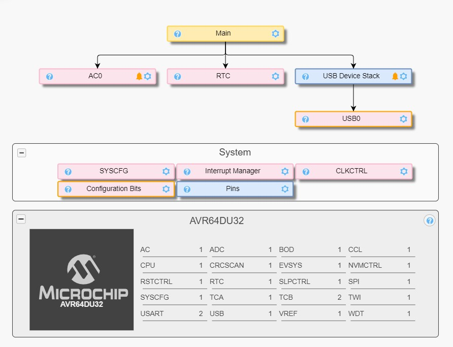

#### USB General Settings
The configuration is set so the AVR DU will identify as an HID device on the highest level. The Mouse protocol is selected.

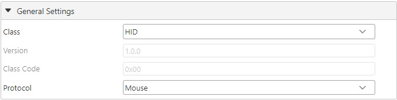

#### USB Device Descriptors
The Device Descriptors can be left as default with only the product name changed to this example.

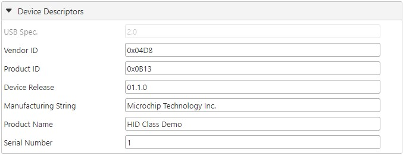

#### USB Events and Callbacks

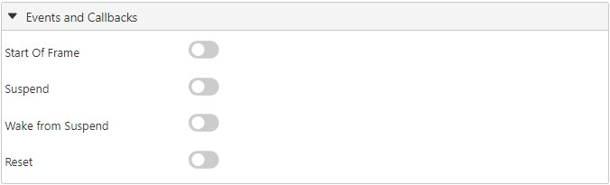

#### USB Interrupt Settings
The USB is set to be interrupt driven.

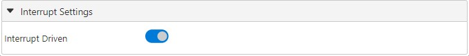

#### USB Interfaces
For this project, an HID interface is needed. It does not need any modification beyond being added.

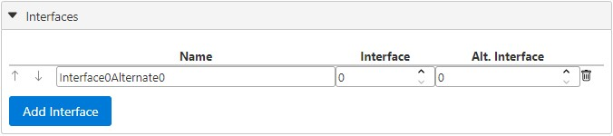

#### USB HID Interface
The interface created in the last step does not need any modification, and is best left as default.

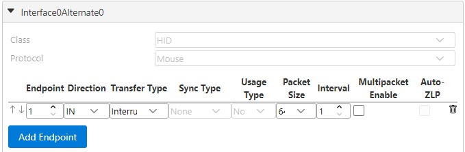

### Device Clock Setup
The CLKCTRL module is located in the System Firmware drop-down menu. This example is configured to run on 24 MHz. The minimum oscillator frequency available for USB on the AVR DU is 12 MHz.

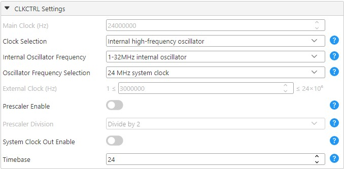

### USB Voltage Detection Setup
To ensure that the USB peripheral only tries to attach to the bus when the Curiosity Nano is connected to the PC, the Analog Comparator(AC) will periodically check if the voltage is within the acceptable range for VBUS.

#### Voltage Reference Setup
In the VREF peripheral, the Voltage Reference is set to 2.048V.

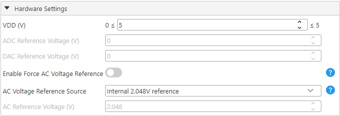

#### Analog Comparator Setup (AC)

##### Analog Comparator Hardware Settings
The Analog Comparator must be enabled by toggling Enable under Hardware Settings.

The positive input is set to the USB DETECT pin on the curiosity nano which by default is connected to Positive Pin 4 on the AC. The detection threshold is set using the Digital-to-Analog Converter(DAC) reference (DACREF) which is selected as the negative input to the AC.

To calculate the DACREF value, we can use the formula from the data sheet:

*VDACREF = (DACREF / 256) * VREF*

 If the desired threshold is known, use the built-in feature of the MCC to obtain it. Use the value 0.32V as a threshold due to the voltage divider implemented on the Curiosity Nano. Inputting this value into the Requested Voltage field will populate the DACREF value.

Refer to the [AVR64DU32 Curiosity Nano User Guide](https://ww1.microchip.com/downloads/aemDocuments/documents/MCU08/ProductDocuments/UserGuides/AVR64DU32-Curiosity-Nano-UserGuide-DS50003671.pdf) for more information on how the USB DETECT is implemented on the Curiosity Nano.

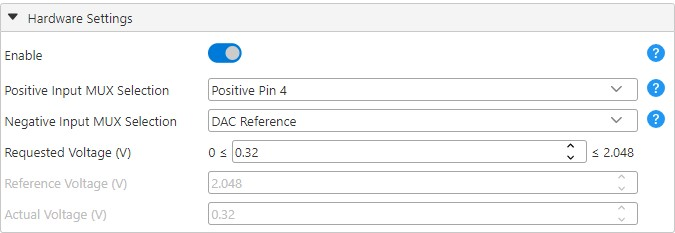

#### Real-Time Counter Setup
##### RTC Period Settings
In the Hardware Settings, enable the RTC. Note down the RTC Clock Source Selection (32768 Hz /32 = 1024 Hz), as it will impact the Period Selection value needed for the Periodic Interrupt Timer. The 1 second period is used for power handling and does not need to be done very often. 

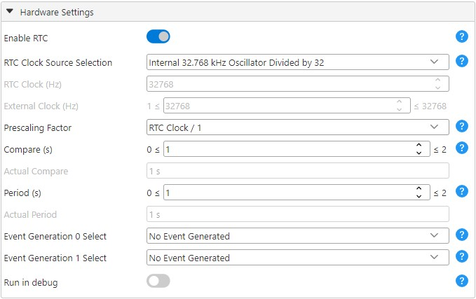

##### RTC Periodic Interrupt Control Settings
The Periodic Interrupt Timer (PIT) is enabled for this example, and the period selection is set to RTC Clock Cycles 16. Together with the Prescaling factor set to 1, this gives us an interrupt frequency of 64 Hz. The PIT interrupt is used to read the state of the joystick/switches and needs to be updated more often than the power monitor.

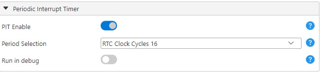

##### RTC Interrupt Control Settings
Both the PIT and OVF Interrupt flag are enabled to allow for an interrupt routine.

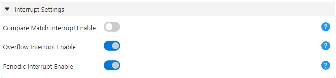

#### Interrupt Manager Setup
Enable global interrupts in the Interrupt Manager under System Firmware to recognize the USB and RTC interrupts.

### Device Pin Setup
This example uses eight pins for joystick/switches and one for monitoring power. Setting inputs and outputs can be done in the **Pin Grid View** tab. The joystick and all the switches are set to input on PA0-PA7 together with PC3 for the Analog Comparator. 

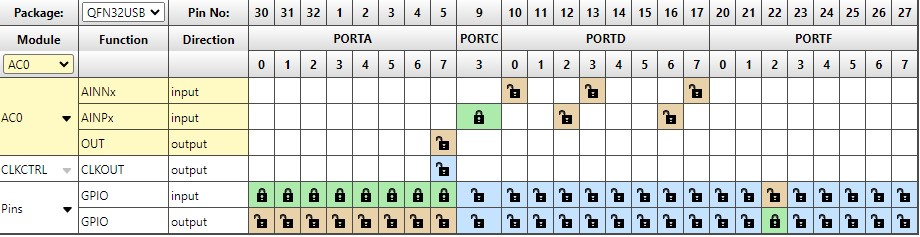

Naming and configuring the different pins can be done in the *System>Pins* menu. The input pins from the joystick/switches needs pull-up and inverted I/O.

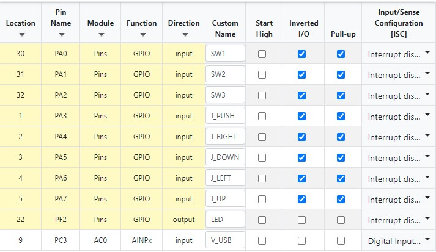

## Operation
This example can be tested by following these steps:

If using the provided MPLAB X project, skip to step 3.
1. Generate the MCC code as described in the MCC section of this readme.
2. Replace the contents of the generated `main.c` with the contents of the provided file.
3. Connect the Debugger plug on the Curiosity Nano Board to the PC and upload the C code.
4. Connect the PC to the Target plug to start the USB communication.
5. Moving the joystick will move the mouse. SW2 is left click and SW3 is right click.

## Summary
This example has demonstrated how the USB HID class can be used on an AVR DU to function as a mouse.